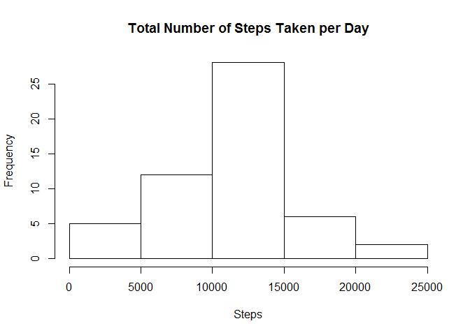
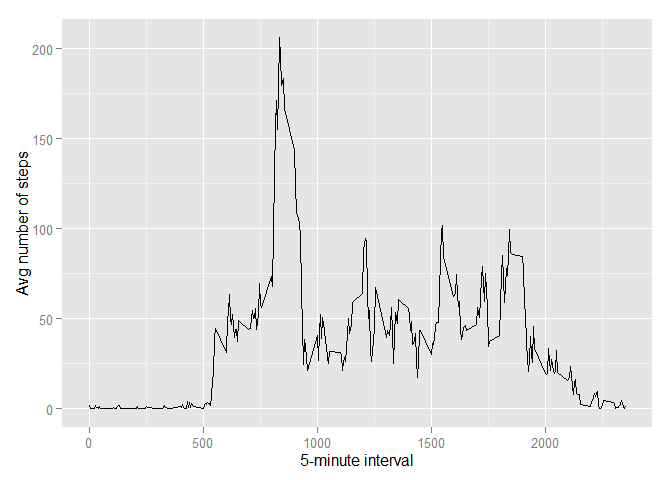
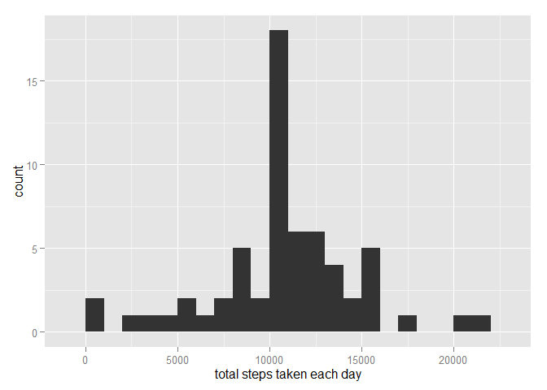
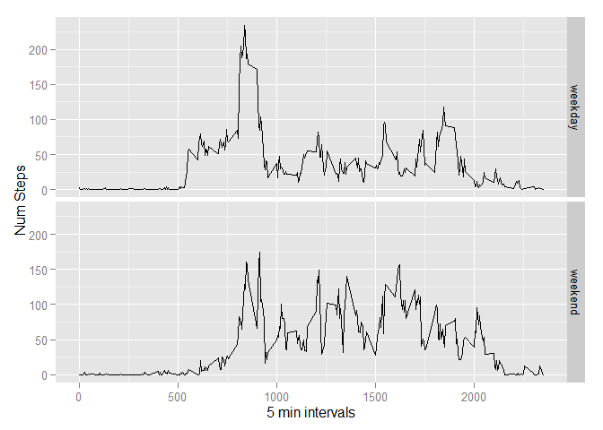

# Reproducible Research: Peer Assessment 1


## Loading and preprocessing the data

```r
unzip(zipfile = "activity.zip")
data <- read.csv("activity.csv")
```
## What is mean total number of steps taken per day?

```r
hist(tapply(data$steps,data$date,sum), main = paste("Total Number of Steps Taken per Day"), xlab="Steps")
```

 

```r
## Mean
mean(tapply(data$steps,data$date,sum, na.rm=TRUE), na.rm=TRUE)
```

```
## [1] 9354.23
```

```r
## Median
median(tapply(data$steps,data$date,sum, na.rm=TRUE), na.rm=TRUE)
```

```
## [1] 10395
```

## What is the average daily activity pattern?

```r
averages <- aggregate(x=list(steps=data$steps), by=list(interval=data$interval),
                      FUN=mean, na.rm=TRUE)
library(ggplot2)
ggplot(data=averages, aes(x=interval, y=steps)) +
    geom_line() +
    xlab("5-minute interval") +
    ylab("Avg number of steps")
```

 

```r
## Max Average
averages[which.max(averages$steps),]
```

```
##     interval    steps
## 104      835 206.1698
```

## Imputing missing values

```r
## Number of rows with missing data
nrow(data[is.na(data$steps)==TRUE,])
```

```
## [1] 2304
```

```r
## Create empty and merge with averages
empty <- data[is.na(data$steps)==TRUE,]
empty$steps <- averages[match(empty$interval,averages$interval),"steps"] 
## Combine non empty rows with now filled in empty
filled=rbind(empty, data[is.na(data$steps)==FALSE,])

qplot(tapply(filled$steps, filled$date, FUN = sum), binwidth = 1000, xlab = "total steps taken each day")
```

 

```r
## Mean
mean(tapply(filled$steps,filled$date,sum, na.rm=TRUE), na.rm=TRUE)
```

```
## [1] 10766.19
```

```r
## Median
median(tapply(filled$steps,filled$date,sum, na.rm=TRUE), na.rm=TRUE)
```

```
## [1] 10766.19
```

Mean and median values are different due to adding more data points will always skew the data.  I think it would have been better to remove all na's instead of estimating what they should have been.  


## Are there differences in activity patterns between weekdays and weekends?

```r
#set all values to weekday
data$DayType = "weekday"
#now set those that are weekends to weekend
data$DayType[weekdays(as.POSIXct(data$date), FALSE) %in% c("Saturday", "Sunday")]="weekend" 

averages <- aggregate(steps ~ interval + DayType, data = data, mean)
ggplot(averages, aes(interval, steps)) + geom_line() + facet_grid(DayType ~ .) + 
  xlab("5 min intervals") + ylab("Num Steps")
```

 

